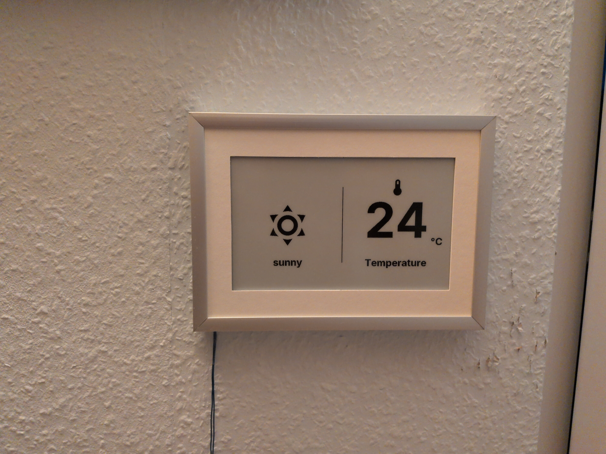
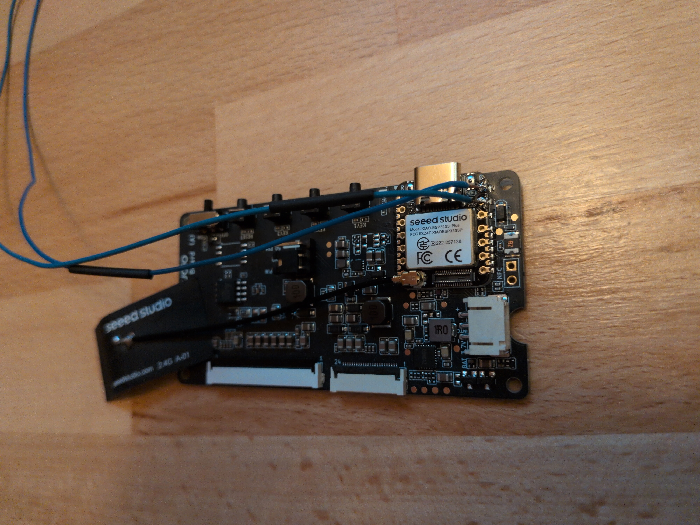
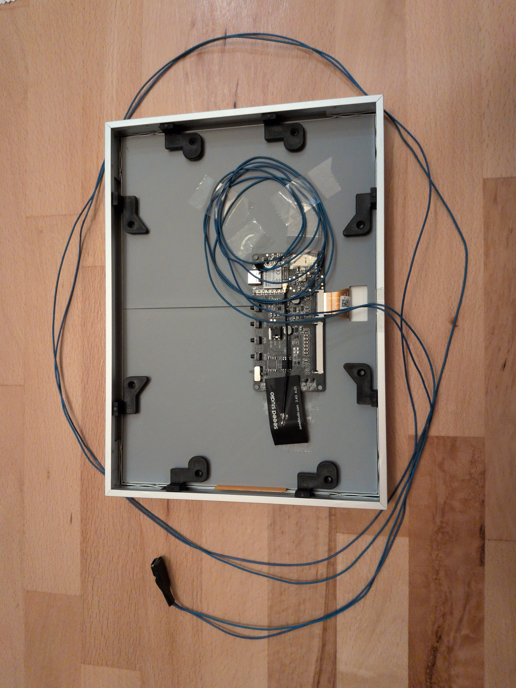

# Ink-Frame

My version of a photo frame with an e-ink display built in. This build uses the [TRMNL 7.5" (OG) DIY Kit](https://www.seeedstudio.com/TRMNL-7-5-Inch-OG-DIY-Kit-p-6481.html). This repo includes my reasoning for frame and power connection, my 3d models and basic build steps.

## Frame Selection
I wanted a picture frame that fits the entire e-ink display whilst having proportionate margins. Therefore, I looked at standard frame sizes in a . Here is an excerpt:
| Frame W (cm) | Frame H (cm) | Mat W | Mat H | Diff | % of max | Rating |
| ------------ | ------------ | ----- | ----- | ---- | -------- | ------ |
| 13           | 18           | 1.5   | 0.75  | 0.75 | 50%      | Uneven |
| 15           | 21           | 2.5   | 2.25  | 0.25 | 10%      | Good   |
| ...          | ...          | ...   | ...   | ...  | ...      | ...    |

A 15x21 cm frame was the smallest frame I could find that fits the e-ink display and has reasonable margins of 2.5 and 2.25 cm with only a 0.25 cm (~10%) difference.

## Power Connection
While e-ink displays have a very low power consumption, I didn't want to worry about charging a battery. Therefore, I decided to use cables for vcc and gnd, thin enough to fit between wall and frame. I wired those directly to the esp:

> Because I did not have an usb-c breakout board with the right resistor to get 5v from an usb-c power supply, I used a battery charging module instead, that happened to break out vcc and gnd.

## 3d model
The 3D models were created with build123d. They include a  and  part of the mat and a  and  part of the backplate. They are split into two halves to fit on the 18x18 cm print bed of the a1 mini.

## Bill of material
| Amount | Component |
| ------ | --------- |
| 1      | 7.5" e-ink display (from the [kit](https://www.seeedstudio.com/TRMNL-7-5-Inch-OG-DIY-Kit-p-6481.html)) |
| 1      | driver board (from the [kit](https://www.seeedstudio.com/TRMNL-7-5-Inch-OG-DIY-Kit-p-6481.html)) |
| 1      | frame 15x21 cm (din a5) (specifically [this](https://www.hornbach.de/p/portraitrahmen-alu-duo-silber-15x21-cm-din-a5/6799428/)) |
| 1      | (white) paper for the look of the mat |
| 1      | some small usb-c to 5v board |
|        | wire |
|        | (heat-shrink tubing) |

## Build Steps
Solder the power cables to the esp32 on the driver board and to the usb-c board. If desired, wrap the usb-c board into heat-shrink tubing.
Cut out the mat from paper, using the 3d printed mat as template.

Now we can start with the frame. Lay in the paper mat, then the two 3d-printed mat halves. Peel the film off the e-ink display and place it in the recess of the 3d-printed mat. 

> Depending on tolerances put spacers between mat and frame. 
> (For me the e-ink display ribbon cable wasn't in the center, requiring a spacer of the mat on the right and of the backplate on the left.)

Put in the backplate and place the driver board onto the pins of the backplate.

> Despite the pins I had to secure the driver board to the backplate with a bit of tape.

Plug in the display ribbon. Then, I used the original clamp pieces of the frame to hold down the backplate. (The height of my 3d prints imitate the height of the original backplate of the frame.) 
Finally, I taped excess cable length to the backplate and taped the cable to the side of the frame, where it should leave the frame.
